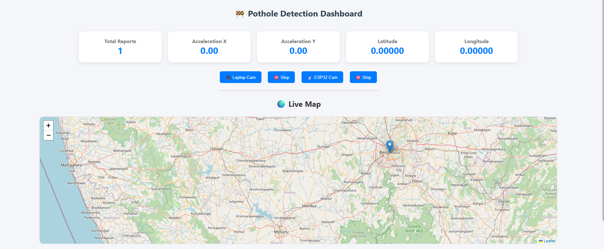
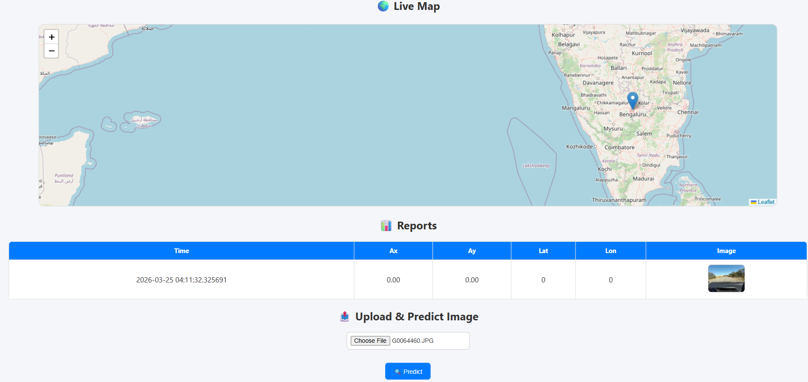
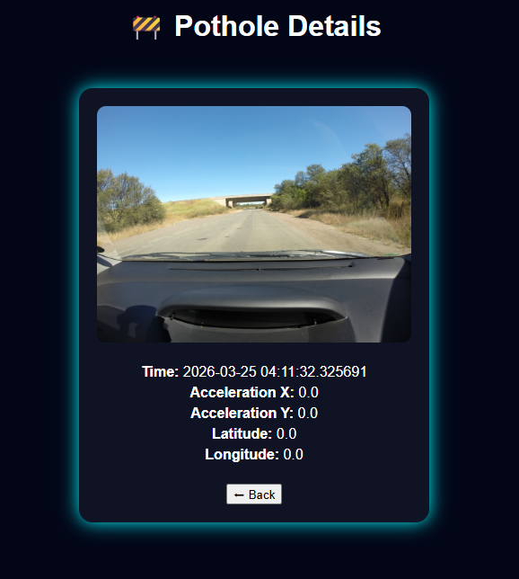
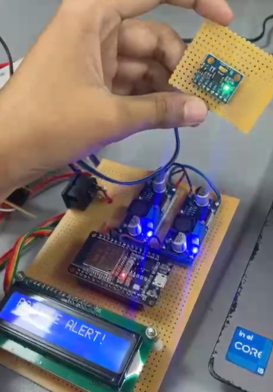
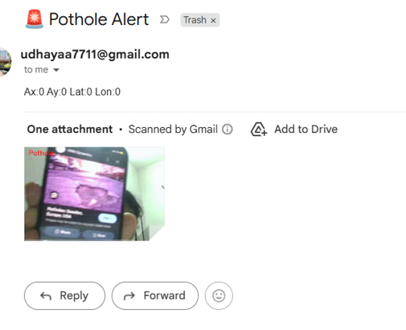

# 🛣️ Real-Time Hybrid Pothole Detection System

### (ResNet-18 + MPU6050 + ESP32 + Flask)

---

## 📌 Overview

This project implements a **real-time pothole detection and alert system** by combining:

* Deep learning (**ResNet-18**) for image-based classification
* Sensor data (**MPU6050**) for vibration-based detection
* Live camera feed (**ESP32 / Laptop Camera**)
* Backend server using Flask

The system detects potholes, logs data, captures images, and sends alerts automatically.

---

## 🚀 Key Features

* 🔍 **Real-time pothole detection** using ResNet-18
* 📡 **Sensor-based detection (MPU6050 via UDP)**
* 📷 **Live video streaming** (Laptop camera & ESP32 camera)
* 🧠 **Hybrid decision system (Vision + Vibration)**
* 🗄️ **Automatic logging using SQLite database**
* 🖼️ **Image capture of detected potholes**
* 📧 **Email alerts with image attachment**
* 🌍 **Location tracking (Latitude & Longitude)**
* 📊 **Web dashboard to view reports**

---

## 🧠 Deep Learning Model

* Model: ResNet-18 (custom trained)
* Classes:

  * `0 → Normal`
  * `1 → Pothole`

### 🔍 Prediction Logic

* Frames are resized to **224×224**
* Normalized using ImageNet stats
* Prediction done using PyTorch inference

---

## ⚡ Sensor Integration (MPU6050)

* Data received via **UDP socket (port 5005)**
* Input format:

```
Ax, Ay, Latitude, Longitude
```

### 🚨 Detection Condition

```python
pothole = (abs(Ax) >= 0.40 or abs(Ay) >= 0.40)
```

---

## 🔁 Hybrid Detection Workflow

1. MPU6050 detects abnormal vibration
2. ESP32 camera captures image
3. ResNet-18 classifies frame
4. If pothole detected:

   * Image is saved
   * Data stored in database
   * Email alert is sent

---

## 🖥️ System Architecture

* **Frontend:** HTML (Flask templates)
* **Backend:** Flask server
* **Database:** SQLite (`pothole.db`)
* **Model:** PyTorch (ResNet-18)
* **Hardware:** ESP32 + MPU6050

---

## 📂 Project Structure

```
pothole-detection/
│── app.py
│── pothole_model.pth
│── pothole.db
│── results/          # saved images
│── uploads/          # user uploads
│── templates/
│── requirements.txt
│── README.md
```

---

## ⚙️ Installation

```bash
git clone https://github.com/your-username/pothole-detection.git
cd pothole-detection
pip install -r requirements.txt
```

---

## ▶️ Run the Application

```bash
python app.py
```

Server runs on:

```
http://localhost:5000
```

---

## 🎥 Live Streaming Options

### 📷 Laptop Camera

```
/start_laptop
/stop_laptop
```

### 📡 ESP32 Camera

```
/start_esp32
/stop_esp32
```

---

## 📊 API Endpoints

* `/data` → Fetch latest pothole reports
* `/predict` → Upload image for prediction
* `/details/<id>` → View specific pothole
* `/results/<filename>` → View stored images

---

## 📸 Results

### 🖥️ Web Dashboard
Real-time monitoring dashboard showing sensor values, pothole count, and live map.




---

### 📍 Pothole Details View
Detailed information including timestamp, acceleration values, and captured image.



---

### ⚡ Sensor Detects Abnormal Motion
MPU6050 detecting vibration spikes indicating potholes.



---

### 📧 Email Alert System
Automatic alert triggered with pothole image and sensor data.



---

## 🗄️ Database Schema

Table: `potholes`

| Field    | Description      |
| -------- | ---------------- |
| id       | Primary key      |
| time     | Timestamp        |
| Ax, Ay   | Sensor values    |
| lat, lon | Location         |
| image    | Saved image path |

---

## 📧 Email Alert System

* Sends alert when pothole detected
* Includes:

  * Sensor values
  * Location
  * Captured image

---

## 🔥 Innovation

Unlike traditional vision-only systems, this project:

* Combines **real-world sensor data + AI**
* Works even in **low visibility conditions**
* Provides **automated logging + alerts + tracking**

---

## 📈 Future Improvements

* GPS map visualization
* Mobile app integration
* Cloud dashboard
* Edge deployment optimization

---

## 👨‍💻 Author

Udhaya M
